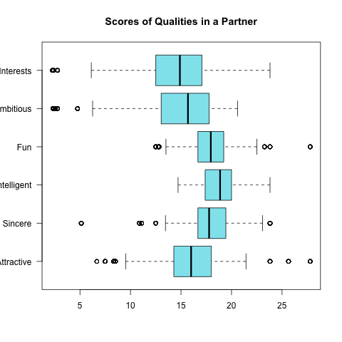
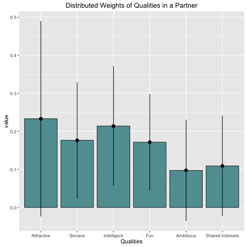
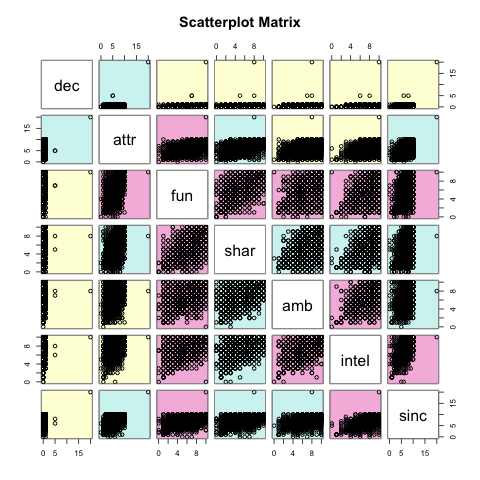
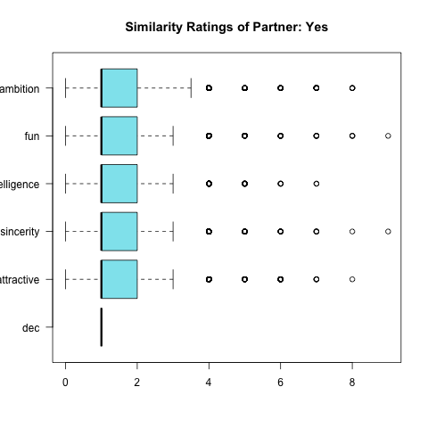
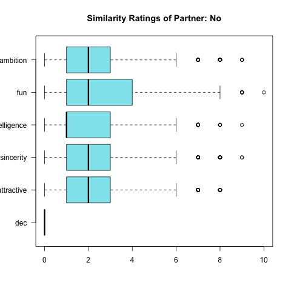

```{r setup, include=FALSE}
knitr::opts_chunk$set(echo = TRUE)
library(stargazer)
load('../data/regression.RData')
load('../data/regression-gender.RData')
load('../data/correlation-matrix.RData')
load('../data/bayes-data.RData')
source("../code/functions/regression-functions.R")
```

## Introduction

My public GitHub repo including all code, images and data is [here](https://github.com/laurenhanlon/speed_dating_analysis)

For this analysis I will refer to a "speed dating" experiment conducted in 2006. You can find the data [here](https://cl.ly/2Y3I1d3b0p2N/Archive%202014-08-05%20at%201.27.45%20AM.zip).

More background on the experiment:

> "In the experiment, a few hundred students in several waves were randomly assigned to 10 short dates. At the end of each 4-minute date each participant filled out a scorecard that asked them to decide whether or not they would like to see the other person again (1=yes or 0=no). The participants were also asked to record subjective numerical ratings for the other person (attractive, sincere, intelligent, fun, ambitions, has shared interests/hobbies). A pre-interview and a follow-up survey also captured data about participants' backgrounds, preferences, and some other characteristics.""

In particular, I am answering the following questions: 

1. Discuss and quantify the importance, in general, of each person a's 6 ratings of person b (attractiveness, sincerity, intelligence, and so forth) in determining if person a is interested in seeing person b again.

2. Some people are more likely to want to see other people again. Discuss the implications for the general conclusions you reached in question 1 and see if you can account and correct for this kind of underlying variation in the person making the evaluation.

3. With some people, it is more likely that others will want to see them again. Is there evidence in the data for this kind of variation in the person being rated? If so, how can you account and correct for it and what are the implications for your conclusions from 1 & 2?

## Data

The speed dating data set is 4435 x 195 in dimensions. There are 4435 rows, each row being a unique speed date and some of the key columns I will be working with in this analysis include:

- `dec`: Decision (1=Yes 0=No) to see the person again

- `attr`: Attractiveness rating

- `sinc`: Sincerity rating

- `intel`: Intelligence rating

- `fun`: Fun rating

- `amb`: Ambition rating

- `shar`: Shared interests/hobbies rating

## Question 1
_Discuss and quantify the importance, in general, of each person a's 6 ratings of person b (attractiveness, sincerity, intelligence, and so forth) in determining if person a is interested in seeing person b again._

### Ranking of qualities before speed dating session

Before speed dating started in this study, each dater was requested to answer questions regarding the qualities they look for in a potential date. My thought was to look at their rankings of qualities to see if it lines up with how they eventually made their decision on whether to see a person again.

The trouble with this question was that approximately 1/3 of the daters were asked to rank qualities on a 1-10 scale, and the other 2/3 of daters were asked to distrubute 100 points amongst the qualities. I thought it was important to keep both results, but since the study uses a 1-10 scale in the scorecard while the speed dating is occuring, I will use the results from the prior method to compare results of what a dater thinks they want, versus how they actually make decisions.

#### Ranking qualities on a 1-10 scale

```{r, out.width = "300px", echo=FALSE, fig.align="center"}

```

We can conlude that when ranking qualities on a 1-10 scale, the ranking is as follows: intelligence, fun, sincerity, attractiveness, shared interests followed by ambition.

#### Distrubuting points amongst qualities

```{r, out.width = "300px", echo=FALSE, fig.align="center"}

```

We can conlude that when distributing 100 points amonst qualities, the ranking is as follows: attractiveness, intelligence, sincerity, fun, shared interests followed by ambition.

### Ranking of qualities while speed dating

Now I turn to look at how these qualities influence a dater's decision on whether or not to continue seeing another person while speed dating.

#### Coefficient estimates of the least squares model

For this analysis I looked at an indvidual's rating of their speed-dater's attractiveness, sincerity, intelligence, fun, ambition and shared interests versus whether an individual wanted to see him or her again, our predictor variables will be attractiveness, sincerity, intelligence, fun, ambition and shared interests, and our Y varialbe will be their decision whether they wanted to see that person again.

`dec` = $\beta_0$ + $\beta_1$ x `attr` + $\beta_2$ x `sinc` + $\beta_3$ x `intel` + $\beta_4$ x `fun` + $\beta_5$ x `amb` + $\beta_6$ x `shar`

This table shows the least squares coefficient estimates of the multiple linear regression of a dater's decision to match with the person on attractiveness, sincerity, intelligence, fun, ambition and shared interests. How we should interpret this is that the coefficients for each of these represent the average effect of increasing that particular predictor, while holding all other predictors constant; e.g. the coefficient for `sinc` is the average effect of a dater's judgement of a person's sincerity while holding all other variables fixed.

```{r results='asis', echo=FALSE}
stargazer(reg_summary_multi$coefficients, title = 'Coefficient estimates', type='latex', header=FALSE)
```

What we note here is that the coefficient for `intel` and `amb` is negative, indicating they actually has a negative effect on a dater's decision to match when compared against the other predictors.

#### Correlation matrix

I constructed a correlation matrix to interpret the correlation between all variables to see how each of them interact with one another

```{r results='asis', echo=FALSE}
stargazer(correlation_matrix, title = 'Correlation matrix', type='latex', header=FALSE)
```

In this correlation matrix table we can clearly tell that `attr` has the strongest correlation with `dec` (0.479) while `intel` (0.191) and `amb` (0.158) are weaker.

High correlations between a dater's rating of a person include: `sinc` and `intel` (0.649), `fun` and `shar` (0.618) and `intel` and `amb` (0.605)

These relations are represented visually in the scatterplot matrix graph below. The pink scatterplots represent those with the highest correlations, whereas the relationship between `newspaper` and `sales` is represented as blue, indicating a very weak correlation.

```{r, out.width = "200px", echo=FALSE, fig.align="center"}

```

```{r, echo=FALSE}
reg <- multiregression
```

### Results: Question 1

These results made me laugh a bit. In the pre-assessment, before the speed dating began, daters rated intelligence as either their #1 or #2 indicator of what they look for in another person, yet when deciding whether or not to see a person again, intelligence actually had a _negative_ correlation. I assume this can be the cause of one or two things: 1) Individuals like to say that they value intelligence to curb their own ego, or to show others that they care more about what's on the inside than the outside or 2) We saw a 0.374 correlation between attractiveness and intelligence, and maybe in the long run, attractiveness beats intelligence. 

The results for question 1 are quite clear in that attractiveness plays highest role in determining whether a dater is likely to want to see a person again. The rankings of qualities are as follows: attractiveness, shared interests, sincerity, fun, intelligence and ambition. Personally, I find these ratings somewhat dismal and a little surprised that intelligence and ambition actually have a negative correlation.

---

### Question 2

_Some people are more likely to want to see other people again. Discuss the implications for the general conclusions you reached in question 1 and see if you can account and correct for this kind of underlying variation in the person making the evaluation._

Hypothesis: People want to continue seeing people they think are similar to themselves. 

This has been studied time and time again and while people might say "opposites attract", the fact of the matter is that people are interested in people like themselves. A great study that was done on eHarmony's data studies this question, and if you'd like to learn more [FiveThirtyEight](http://fivethirtyeight.com/features/in-the-end-people-may-really-just-want-to-date-themselves/) wrote an article about it.

To conduct this analysis, I looked at the dater's self-ratings of themselves against the ratings of the person they met. I subsetted the data based on whether the dater wanted to see that person again, then looked at the absolute values between their self-rating and the rating of the person they met. Lower values correspond to higher similarity, while higher values correspond to lower similarity.

```{r, out.width = "200px", echo=FALSE, fig.align="center, fig.show='hold'"}


```

The graph on the left, which is the graph for those who indicated they wanted to see them again, are all between 1-2, whereas the graph on the right, which is the graph for those who indicated they did not want to see them again, have much more variation, ranging from 1.5-2.5. From these graphs, are able to say that if a person felt that their qualities were in line with those of the other individual, then they were more likely to indicate that they wanted to see them again. 

---

### Question 3

_With some people, it is more likely that others will want to see them again. Is there evidence in the data for this kind of variation in the person being rated? If so, how can you account and correct for it and what are the implications for your conclusions in 1 & 2._

In order to answer this question, I decided to use a Bayesian approach. My ultimate question (which is a bit more refined than this one) is: Given the other person decides to see me again, what is the percentage that I also want to see them again. I thought this was an interesting question because it speaks to A) a person's level of confidence (if they believe the other person liked them, are they more likely to like them?) and B) the variability in mutual feelings about others while dating.

I essentially took a dater's rating of the individual they met and looked at it against the individual's rating of the dater. To explain a bit further, I created duplicates of the dating table, then created a unique ID based on the `iid` and `pid` of that particular date. I then merged the tables on this key, and deleted duplicates. 

Essentially I had a dataframe that looked like this: 

```{r, echo=FALSE}
print(sample_of_data)
```

- `match_id`: unique match of a dater with another individual

- `iid`: unique dater ID

- `pid`: unique partner ID

- `iid_dec`: decision of dater whether to see partner again

- `pid_dec`: decision of partner whether to see dater again

By deduping the table, we are left with unique `(iid, pid)` tuples, meaning that if `(iid(5), pid(8))` then `(pid(8), iid(5))` does not exist.

My next step was to determine conditional probabilities. To interpret the table below, `[Y_me, Y_them]` is the percentage where the dater and partner mutually liked each other. `[N_me, Y_them]` is the percentage where the dater did not like the partner, but the partner liked the dater. `[Y_me, N_them]` is the percentage where the dater liked the partner, but the partner did not like the dater. `[N_me, N_them]` is the percentage where neither the dater or partner liked each other.

```{r, echo=FALSE}
print(probs_percentages)
```

From this, we can see that in some cases, it is more likely that others will want to see them again, as evidenced by `[Y_me, Y_them]` + `[N_me, Y_them]` = 0.325. However, the case of the dater wanting to see the partnger again is a bit higher as `[Y_me, Y_them]` + `[Y_me, N_them]` = 0.530.

To answer the question: Given the partner likes the dater, what is the probability the dater likes the partner? we employ Bayes' Theorem. This is really just a simple question of conditional probability.

Pr(A|X) = Pr(X|A)Pr(A) / Pr(X|A)Pr(A) + Pr(X|not A)Pr(not A)

When we compute this with Pr(Dater Yes | Partner Yes) we obtain:

```{r}
pAX
```

Thus, given the partner chose to see them again, there is an 18.5% chance that the dater will choose to see them again as well. Interpreting this result, we might be able to apply this to the real world, outside of speed dating, in which case this predicts a slim chance for mutual liking.

---

### BONUS

In looking at this data, my initial thought that came to mind might be gender bias (i.e. women vs. men might make decisions based on different factors). To explore this a bit more, I separated the data based on gender and looked at the correlations between qualities and a dater's decision to see an individual again or not.

### Correlation matrix

I first looked at the correlation matricies for each gender, then to compare them I layered the correlation matrix for women and subtracted the correlation matrix for men.

```{r results='asis', echo=FALSE}
stargazer(correlation_matrix_gender_differences, title = 'Correlation matrix (women - men)', type='latex', header=FALSE)
```

From this correlation matrix, I specifically want to look at the first row: the correlation between a dater's decision and each of the qualities. A positive score means that there is a stronger correlation between a dater's decision and that quality in **women** and a negative score means that there is a stronger correlation between a dater's decision and that quality in **men**.

From the table we can assume that women value intelligence, fun and sharing interests moreso than men, and men value attractiveness (not surprised), sincerity (semi shocking?), and ambition (yay!) moreso than women.

### Coefficient estimates of the least squares model

```{r results='asis', echo=FALSE}
stargazer(reg_summary_multi_female$coefficients, title = 'Coefficient estimates for women', type='latex', header=FALSE)
```

```{r results='asis', echo=FALSE}
stargazer(reg_summary_multi_male$coefficients, title = 'Coefficient estimates for men', type='latex', header=FALSE)
```

From these tables, we can see the differences in qualities and their effect on whether a dater wants to see that person again. Breaking down these results by individual attributes:

`attr`: male > female

`sinc`: male > female

`intel`: male < female

`fun`: male = female

`amb`: male < female

`shar`: male = female

From these results, we can conclude with some degree of certainty (since our standard errors are all <0.02 for men and <0.01 for women) that males value attractiveness, sincerity (semi shocking?),  slightly more than females

## Conslusion

Tada! This completes my analysis of the speed dating data. In conclusion, people are going to base their decisions primarily based off of attractiveness, similarity to themselves and on the probability that the person they're dating likes them!